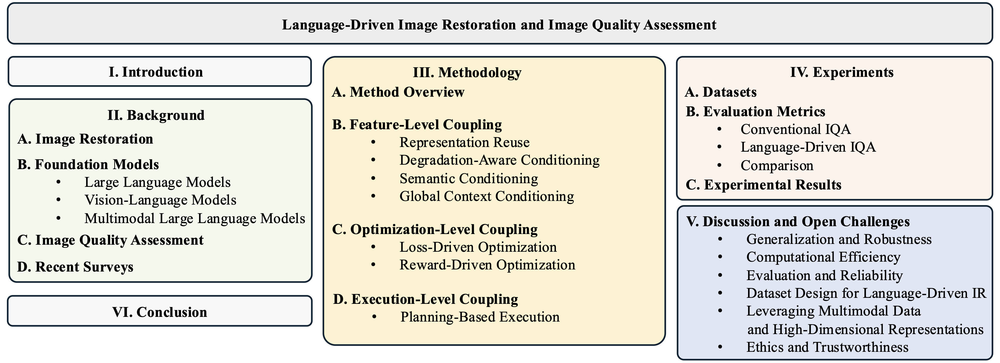
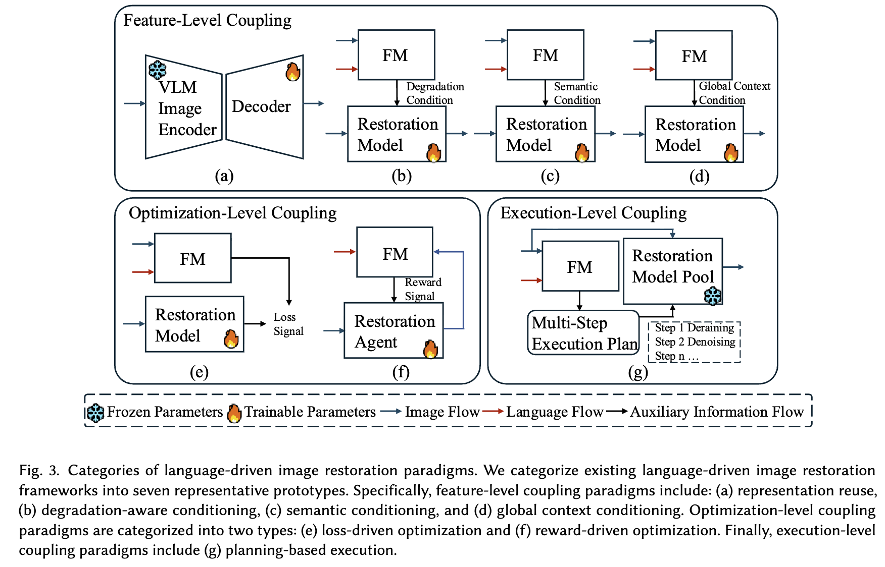
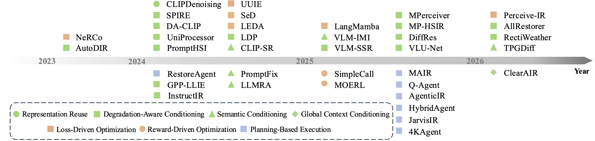

# Language-Driven Image Restoration and Semantic-Aware Quality Assessment: A Survey

<div align="center">
<a href="https://www.preprints.org/manuscript/202603.2366"></a>
<a href="https://github.com/MingyuLiu1/Language-Driven-IR-and-IQA/stargazers"></a>
<a href="https://github.com/MingyuLiu1/Language-Driven-IR-and-IQA/network/members"></a>
<a href="https://github.com/MingyuLiu1/Language-Driven-IR-and-IQA/issues"></a>
<a href="https://github.com/MingyuLiu1/Language-Driven-IR-and-IQA/blob/main/LICENSE"></a>
</div>

A structured repository for papers, taxonomy, benchmarks, and resources on language-driven image restoration (IR) and language-driven image quality assessment (IQA). The repo maintained by [TUM-AIR](https://www.ce.cit.tum.de/air/home/) will be continuously updated to track the latest work in the community. 


## 📄 Abstract

Image restoration aims to recover a high-quality image from its degraded counterpart by mitigating distortions introduced during acquisition, transmission, or environmental interaction. Despite the remarkable progress of deep learning–based restoration models, most conventional approaches remain tightly coupled to predefined degradation assumptions and pixel-level supervision, limiting their capability to handle complex and diverse scenarios or user-dependent restoration targets. Recent advances in multimodal large language models (MLLMs) and vision–language models (VLMs) have introduced a new paradigm in which restoration systems incorporate semantic reasoning, language-driven interaction, and cross-modal knowledge. By integrating language models, restoration is extended beyond low-level reconstruction toward degradation interpretation, perceptual alignment, and high-level controllability. In this survey, we provide a systematic review of language-driven image restoration, organized through an interaction-centric taxonomy that characterizes how language models are coupled with restoration pipelines. We analyze representative frameworks from the perspectives of semantic conditioning, perceptual supervision, and execution-level interaction, and discuss how these mechanisms influence restoration objectives and system design. In addition, we review emerging language-driven image quality assessment (IQA) approaches, highlighting their complementary role to conventional fidelity-based metrics. Finally, we identify unresolved challenges and outline potential research directions toward more robust, efficient, and trustworthy restoration techniques.

**Keywords: Image Restoration, Image Quality Assessment, Vision Language Model, Multimodal Large Language Model**

<p align="center">

</p>

<details>
<summary><b>Prototype</b></summary>
<p align="center">

</p>
</details>

<details>
<summary><b>Timeline</b></summary>
<p align="center">
  
</p>
</details>


## :fire: Update
- [April 08 2026] Preprints version has been released: [Link](https://www.preprints.org/manuscript/202603.2366)


## 📌 TODO

- [ ] Complete the paper table
- [ ] Add language-driven IQA subsection
- [ ] Complete dataset table


## 📚 Papers by Task

<details>
<summary><b>Denoising</b></summary>
<br>

| Method | Venue | Task | Domain | Coupling Level | Code |
|---|---|---|---|---|---|
| [Paper 1](https://arxiv.org/) | CVPR 2024 | Denoising | Natural | Feature-level | [Code](https://github.com/) |
| [Paper 2](https://arxiv.org/) | ECCV 2024 | Denoising | Natural | Optimization-level | N/A |
| [Paper 3](https://arxiv.org/) | AAAI 2025 | Denoising | UHD | Execution-level | [Code](https://github.com/) |
</details>

<details>
<summary><b>Deraining</b></summary>
</details>

<details>
<summary><b>Dehazing</b></summary>
</details>

<details>
<summary><b>Desnowing</b></summary>
</details>

<details>
<summary><b>Deblurring</b></summary>
</details>

<details>
<summary><b>Low-Light Image Enhancement</b></summary>
</details>

<details>
<summary><b>Super-Resolution</b></summary>
</details>

<details>
<summary><b>Underwater Image Enhacenmebt</b></summary>
</details>

<details>
<summary><b>All-in-One</b></summary>
</details>

## ⚖️ Evaluation Metrics

<details>
<summary><b>Conventional IQA Methods</b></summary>
<br>

| Method | Paper / Link | Type | Sub-category | GT Required | Usage |
|---|---|---|---|---|---|
| PSNR | — | Full-Reference | Non-Learning-Based | Yes | Pixel-level fidelity |
| SSIM | [Image Quality Assessment: From Error Visibility to Structural Similarity](https://ieeexplore.ieee.org/document/1284395) | Full-Reference | Non-Learning-Based | Yes | Structural consistency |
| FSIM | [FSIM: A Feature Similarity Index for Image Quality Assessment](https://ieeexplore.ieee.org/document/5705575) | Full-Reference | Non-Learning-Based | Yes | Feature similarity |
| MAE | — | Full-Reference | Non-Learning-Based | Yes | Pixel-wise absolute error |
| MSE | — | Full-Reference | Non-Learning-Based | Yes | Pixel-wise squared error |
| RMSE | — | Full-Reference | Non-Learning-Based | Yes | Root mean squared error |
| ERGAS | [Relative Dimensionless Global Error in Synthesis](https://ieeexplore.ieee.org/document/873730) | Full-Reference | Non-Learning-Based | Yes | Reconstruction accuracy |
| LPIPS | [The Unreasonable Effectiveness of Deep Features as a Perceptual Metric](https://arxiv.org/abs/1801.03924) | Full-Reference | Learning-Based | Yes | Perceptual similarity |
| DISTS | [Image Quality Assessment: Unifying Structure and Texture Similarity](https://arxiv.org/abs/2004.07728) | Full-Reference | Learning-Based | Yes | Perceptual similarity |
| CKDN | [CKDN](#) | Full-Reference | Learning-Based | Yes | Feature-based perceptual similarity |
| AHIQ | [AHIQ](#) | Full-Reference | Learning-Based | Yes | Perceptual similarity |
| TOPIQ-FR | [TOPIQ](#) | Full-Reference | Learning-Based | Yes | Perceptual quality prediction |
| FID | [GANs Trained by a Two Time-Scale Update Rule Converge to a Local Nash Equilibrium](https://arxiv.org/abs/1706.08500) | Full-Reference | Distribution-Based | Yes | Distribution alignment |
| BRISQUE | [No-Reference Image Quality Assessment in the Spatial Domain](https://ieeexplore.ieee.org/document/6272356) | No-Reference | Hand-Crafted | No | Blind perceptual quality estimation |
| NIQE | [Making a “Completely Blind” Image Quality Analyzer](https://ieeexplore.ieee.org/document/6353522) | No-Reference | Hand-Crafted | No | Blind perceptual quality estimation |
| PIQE | [PIQE](https://in.mathworks.com/help/images/ref/piqe.html) | No-Reference | Hand-Crafted | No | Blind perceptual quality estimation |
| LOE | [Naturalness Preserved Enhancement Algorithm for Non-Uniform Illumination Images](https://ieeexplore.ieee.org/document/6804557) | No-Reference | Hand-Crafted | No | Lightness order consistency |
| MUSIQ | [MUSIQ: Multi-scale Image Quality Transformer](https://arxiv.org/abs/2108.05997) | No-Reference | Learning-Based | No | Learning-based NR-IQA |
| MANIQA | [MANIQA](https://arxiv.org/abs/2204.08958) | No-Reference | Learning-Based | No | Learning-based NR-IQA |
| NIMA | [NIMA: Neural Image Assessment](https://arxiv.org/abs/1709.05424) | No-Reference | Learning-Based | No | Aesthetic / perceptual quality prediction |
| HyperIQA | [HyperIQA](https://arxiv.org/abs/2007.09699) | No-Reference | Learning-Based | No | Blind IQA |
| PAQ2PIQ | [PAQ2PIQ](https://arxiv.org/abs/2001.04095) | No-Reference | Learning-Based | No | Blind IQA |
| DBCNN | [Blind Image Quality Assessment with Deep Bilinear Convolutional Neural Network](https://ieeexplore.ieee.org/document/8578498) | No-Reference | Learning-Based | No | Blind IQA |
| TOPIQ-NR | [TOPIQ](#) | No-Reference | Learning-Based | No | Blind quality prediction |
| CNNIQA | [CNNIQA](https://arxiv.org/abs/1406.7799) | No-Reference | Learning-Based | No | Blind IQA |

</details>

<details>
<summary><b>Language-Driven IQA Methods</b></summary>
<br>

| Method | Paper / Link | Type | Sub-category | GT Required | Usage |
|---|---|---|---|---|---|
| CLIP-IQA | [CLIP-IQA](https://arxiv.org/abs/2207.12396) | No-Reference | Alignment-Based | No | Perceptual alignment |
| QualiCLIP | [QualiCLIP](#) | No-Reference | Alignment-Based | No | Perceptual alignment |
| LIQE | [LIQE](https://arxiv.org/abs/2308.05977) | No-Reference | Alignment-Based | No | Language-informed quality estimation |
| SCULA | [SCULA](#) | No-Reference | Alignment-Based | No | Perceptual alignment |
| PromptIQA | [PromptIQA](#) | No-Reference | Alignment-Based | No | Prompt-based IQA |
| GRMP-IQA | [GRMP-IQA](#) | No-Reference | Alignment-Based | No | Prompt / representation alignment |
| ATTIQA | [ATTIQA](#) | No-Reference | Alignment-Based | No | Alignment-based IQA |
| CAP-IQA | [CAP-IQA](#) | No-Reference | Alignment-Based | No | Cross-modal alignment |
| SFD | [SFD](#) | No-Reference | Alignment-Based | No | Semantic-feature-based IQA |
| UniQA | [UniQA](#) | No-Reference | Alignment-Based | No | Unified quality representation |
| RALI | [RALI](#) | No-Reference | Alignment-Based | No | Representation alignment |
| DepictQA | [DepictQA](https://arxiv.org/abs/2305.18842) | No-Reference | Reasoning-Based | No | Language-driven quality understanding |
| DepictQA-Wild | [DepictQA-Wild](#) | No-Reference | Reasoning-Based | No | Real-world IQA reasoning |
| IQAGPT | [IQAGPT](#) | No-Reference | Reasoning-Based | No | Quality reasoning and scoring |
| Co-Instruct | [Co-Instruct](#) | No-Reference | Reasoning-Based | No | Instruction-following IQA |
| Q-Ground | [Q-Ground](#) | No-Reference | Reasoning-Based | No | Grounded quality reasoning |
| SEAGULL | [SEAGULL](#) | No-Reference | Reasoning-Based | No | Quality explanation / decision-making |
| AgenticIQA | [AgenticIQA](#) | No-Reference | Reasoning-Based | No | Agent-based quality reasoning |
| Q-Align | [Q-Align](#) | No-Reference | Scoring-Based | No | Language-guided quality scoring |
| DeQA-Score | [DeQA-Score](#) | No-Reference | Scoring-Based | No | Quality scoring and calibration |
| Dog-IQA | [Dog-IQA](#) | No-Reference | Scoring-Based | No | Quality scoring |
| Q-Scorer | [Q-Scorer](#) | No-Reference | Scoring-Based | No | Language-guided scoring |
| Compare2Score | [Compare2Score](#) | No-Reference | Scoring-Based | No | Comparative quality scoring |
| Q-Insight | [Q-Insight](#) | No-Reference | Scoring-Based | No | Scoring with language insight |
| Q-Ponder | [Q-Ponder](#) | No-Reference | Scoring-Based | No | Deliberative quality scoring |
| Q-Hawkeye | [Q-Hawkeye](#) | No-Reference | Scoring-Based | No | Fine-grained score prediction |
| LEAF | [LEAF](#) | No-Reference | Scoring-Based | No | Language-enhanced score prediction |
| Q-Bench | [Q-Bench](#) | No-Reference | Resources / Benchmarks | No | Benchmarking |
| Q-Bench+ | [Q-Bench+](#) | No-Reference | Resources / Benchmarks | No | Benchmarking |
| Q-Instruct | [Q-Instruct](#) | No-Reference | Resources / Benchmarks | No | Instruction resource |

</details>

<details>
<summary><b>Evaluation Protocols</b></summary>
<br>

| Protocol | Paper / Link | Type | Sub-category | GT Required | Usage |
|---|---|---|---|---|---|
| PLCC | — | Evaluation Protocol | Human-Aligned | No | Correlation with human subjective scores |
| SRCC | — | Evaluation Protocol | Human-Aligned | No | Rank correlation with human judgments |
| KRCC | — | Evaluation Protocol | Human-Aligned | No | Rank consistency |
| Weighted Kappa | — | Evaluation Protocol | Human-Aligned | No | Agreement with human annotations |
| Percent Agreement | — | Evaluation Protocol | Human-Aligned | No | Annotation agreement |
| Precision | — | Evaluation Protocol | Task-Oriented | Yes | Downstream task performance |
| Recall | — | Evaluation Protocol | Task-Oriented | Yes | Downstream task performance |
| F1 | — | Evaluation Protocol | Task-Oriented | Yes | Downstream task performance |
| mIoU | — | Evaluation Protocol | Task-Oriented | Yes | Segmentation quality |
| Accuracy | — | Evaluation Protocol | Task-Oriented | Yes | Classification / recognition performance |
| BLEU-N | [BLEU](https://aclanthology.org/P02-1040/) | Evaluation Protocol | Text-Based | Yes | Textual fidelity evaluation |
| ROUGE-L | [ROUGE](https://aclanthology.org/W04-1013/) | Evaluation Protocol | Text-Based | Yes | Overlap-based text evaluation |
| METEOR | [METEOR](https://aclanthology.org/W05-0909/) | Evaluation Protocol | Text-Based | Yes | Text generation quality |
| CIDEr | [CIDEr](https://arxiv.org/abs/1411.5726) | Evaluation Protocol | Text-Based | Yes | Semantic/text similarity |

</details>


## 📊 Dataset

<details>
<summary><b>Denoising</b></summary>
<br>

| Method | Venue | Task | Domain |
|---|---|---|---|
| [Paper 1](https://arxiv.org/) | CVPR 2024 | Dehazing | Natural |
| [Paper 2](https://arxiv.org/) | ECCV 2024 | Dehazing | Natural |
| [Paper 3](https://arxiv.org/) | AAAI 2025 | Dehazing | Medical |
</details>

<details>
<summary><b>Deraining</b></summary>
</details>

<details>
<summary><b>Dehazing</b></summary>
</details>

<details>
<summary><b>Desnowing</b></summary>
</details>

<details>
<summary><b>Deblurring</b></summary>
</details>

<details>
<summary><b>Low-Light Image Enhancement</b></summary>
</details>

<details>
<summary><b>Super-Resolution</b></summary>
</details>

<details>
<summary><b>Underwater Image Enhacenmebt</b></summary>
</details>

<details>
<summary><b>All-in-One</b></summary>
</details>


## 🤝 &nbsp; Citation

Please visit [Language-Driven Image Restoration and Semantic-Aware Quality Assessment: A Survey](https://www.preprints.org/manuscript/202603.2366) for more details and comprehensive information. If you find our paper and repo helpful, please consider citing it as follows:

```BibTex
@article{liu2026language,
  title={Language-Driven Image Restoration and Semantic-Aware Quality Assessment: A Survey},
  author={Liu, Mingyu and Shu, Haozhan and Cui, Yuning and Zhou, Xingcheng and Cao, Hu and Ren, Wenqi and Shi, Boxin and Knoll, Alois C},
  year={2026},
  publisher={Preprints}
}
```


## 🙏 Acknowledgement

This repository is built as part of our survey project on language-driven image restoration and image quality assessment.

We sincerely thank the research community for its valuable contributions to the following areas:

- image restoration and related datasets
- multimodal learning
- foundation models
- image quality assessment


## License

This repository is released under the [Apache 2.0 license](https://github.com/MingyuLiu1/Language-Driven-IR-and-IQA/blob/main/LICENSE).

