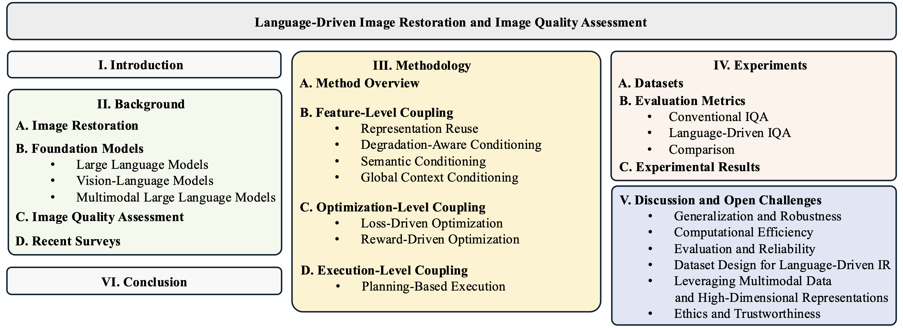
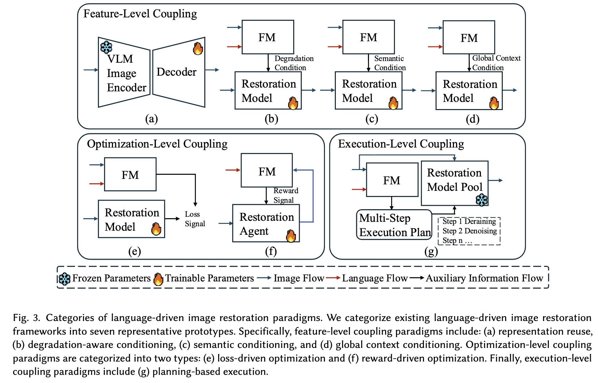
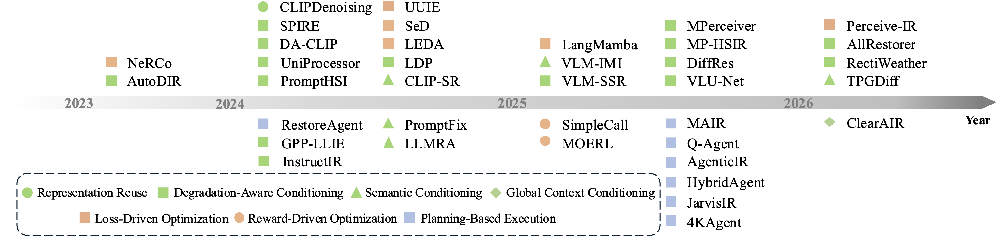

# Language-Driven Image Restoration and Semantic-Aware Quality Assessment: A Survey

<div align="center">
<a href="https://www.preprints.org/manuscript/202603.2366"></a>
<a href="https://github.com/MingyuLiu1/Language-Driven-IR-and-IQA/stargazers"></a>
<a href="https://github.com/MingyuLiu1/Language-Driven-IR-and-IQA/network/members"></a>
<a href="https://github.com/MingyuLiu1/Language-Driven-IR-and-IQA/issues"></a>
<a href="https://github.com/MingyuLiu1/Language-Driven-IR-and-IQA/blob/main/LICENSE"></a>
</div>

A structured repository for papers, taxonomy, benchmarks, and resources on language-driven image restoration (IR) and language-driven image quality assessment (IQA). The repo maintained by [TUM-AIR](https://www.ce.cit.tum.de/air/home/) will be continuously updated to track the latest work in the community. 


## 📄 Abstract

Image restoration aims to recover a high-quality image from its degraded counterpart by mitigating distortions introduced during acquisition, transmission, or environmental interaction. Despite the remarkable progress of deep learning–based restoration models, most conventional approaches remain tightly coupled to predefined degradation assumptions and pixel-level supervision, limiting their capability to handle complex and diverse scenarios or user-dependent restoration targets. Recent advances in multimodal large language models (MLLMs) and vision–language models (VLMs) have introduced a new paradigm in which restoration systems incorporate semantic reasoning, language-driven interaction, and cross-modal knowledge. By integrating language models, restoration is extended beyond low-level reconstruction toward degradation interpretation, perceptual alignment, and high-level controllability. In this survey, we provide a systematic review of language-driven image restoration, organized through an interaction-centric taxonomy that characterizes how language models are coupled with restoration pipelines. We analyze representative frameworks from the perspectives of semantic conditioning, perceptual supervision, and execution-level interaction, and discuss how these mechanisms influence restoration objectives and system design. In addition, we review emerging language-driven image quality assessment (IQA) approaches, highlighting their complementary role to conventional fidelity-based metrics. Finally, we identify unresolved challenges and outline potential research directions toward more robust, efficient, and trustworthy restoration techniques.

**Keywords: Image Restoration, Image Quality Assessment, Vision Language Model, Multimodal Large Language Model**

<p align="center">

</p>

<details>
<summary><b>Prototype</b></summary>
<p align="center">

</p>
</details>

<details>
<summary><b>Timeline</b></summary>
<p align="center">
  
</p>
</details>


## :fire: Update
- [April 08 2026] Preprints version has been released: [Link](https://www.preprints.org/manuscript/202603.2366)


## 📌 TODO

- [x] Complete the paper table
- [x] Add language-driven IQA subsection
- [x] Complete dataset table


## 📚 Papers by Task

<details>
<summary><b>Denoising</b></summary>
<br>

| Method | Venue | Task | Domain | Coupling Level | Code |
|---|---|---|---|---|---|
| [Transfer CLIP for Generalizable Image Denoising](https://openaccess.thecvf.com/content/CVPR2024/papers/Cheng_Transfer_CLIP_for_Generalizable_Image_Denoising_CVPR_2024_paper.pdf) | CVPR 2024 | Denoising | Natural | VLM-Embedded IR | N/A |
</details>

<details>
<summary><b>Deraining</b></summary>
<br>

| Method | Venue | Task | Domain | Coupling Level | Code |
|---|---|---|---|---|---|
| [CLIP-driven rain perception: Adaptive deraining with pattern-aware network routing and mask-guided cross-attention](https://arxiv.org/pdf/2506.01366) | Arxiv 2025 | Deraining | Natural | VLM-Guided IR | N/A |
</details>

<details>
<summary><b>Dehazing</b></summary>
<br>

| Method | Venue | Task | Domain | Coupling Level | Code |
|---|---|---|---|---|---|
| [From Filters to VLMs: Benchmarking Defogging Methods through Object Detection and Segmentation Performance](https://arxiv.org/pdf/2510.03906) | Arxiv 2025 | Dehazing | Natural | Benchmark | N/A |
</details>

<details>
<summary><b>Desnowing</b></summary>
<br>

| Method | Venue | Task | Domain | Coupling Level | Code |
|---|---|---|---|---|---|
| [SnowMaster: Comprehensive Real-world Image Desnowing via MLLM with Multi-Model Feedback Optimization](https://openaccess.thecvf.com/content/CVPR2025/papers/Lai_SnowMaster_Comprehensive_Real-world_Image_Desnowing_via_MLLM_with_Multi-Model_Feedback_CVPR_2025_paper.pdf) | CVPR 2025 | Desnowing | Natural | MLLM-Guided IR | N/A |
</details>

<details>
<summary><b>Deblurring</b></summary>
<br>

| Method | Venue | Task | Domain | Coupling Level | Code |
|---|---|---|---|---|---|
| [LDP: Language-driven Dual-Pixel Image Defocus Deblurring Network](https://openaccess.thecvf.com/content/CVPR2024/papers/Yang_LDP_Language-driven_Dual-Pixel_Image_Defocus_Deblurring_Network_CVPR_2024_paper.pdf) | CVPR 2024 | Deblurring | Natural | VLM-Guided IR | N/A |
</details>

<details>
<summary><b>Low-Light Image Enhancement</b></summary>
<br>

| Method | Venue | Task | Domain | Coupling Level | Code |
|---|---|---|---|---|---|
| [Adapting Large VLMs with Iterative and Manual Instructions for Generative Low-light Enhancement](https://arxiv.org/pdf/2507.18064?) | Arxiv 2025 | LLIE | Natural | MlLM-Guided IR | [Code](https://github.com/sunxiaoran01/VLM-IMI)|
| [Low-Light Image Enhancement via Generative Perceptual Priors](https://arxiv.org/pdf/2412.20916) | ArxiV 2024 | LLIE | Natural | MLLM-Guided IR | [Code](https://github.com/LowLevelAI/GPP-LLIE) |
| [Implicit Neural Representation for Cooperative Low-light Image Enhancement](https://openaccess.thecvf.com/content/ICCV2023/papers/Yang_Implicit_Neural_Representation_for_Cooperative_Low-light_Image_Enhancement_ICCV_2023_paper.pdf) | ICCV 2023 | LLIE | Natural | VLM-Guided IR | [Code](https://github.com/Ysz2022/NeRCo.) |
</details>

<details>
<summary><b>Super-Resolution</b></summary>
<br>

| Method | Venue | Task | Domain | Coupling Level | Code |
|---|---|---|---|---|---|
| [4KAgent: Agentic Any Image to 4K Super-Resolution](https://arxiv.org/pdf/2507.07105) | Arxiv 2025 | SR | UHD | Control-Driven IR | [Code](https://4kagent.github.io) |
| [CLIP-SR: Collaborative Linguistic and Image Processing for Super-Resolution](https://arxiv.org/pdf/2412.11609) | Arxiv 2024 | SR | UHD | VLM-Guided IR | [Code](https://github.com/hengliusky/CLIP-SR) |
| [SeeSR: Towards Semantics-Aware Real-World Image Super-Resolution](https://openaccess.thecvf.com/content/CVPR2024/papers/Wu_SeeSR_Towards_Semantics-Aware_Real-World_Image_Super-Resolution_CVPR_2024_paper.pdf) | CVPR 2024 | SR | UHD | VLM-Guided IR | [Code](https://github.com/cswry/SeeSR) |
| [SeD: Semantic-Aware Discriminator for Image Super-Resolution](https://arxiv.org/pdf/2402.19387) | CVPR 2024 | SR | UHD | VLM-Guided IR | [Code](https://github.com/lbc12345/SeD) |
| [Advancing Real-World Stereoscopic Image Super-Resolution via Vision-Language Model](https://ieeexplore.ieee.org/document/10914541/) | T-IP 2025 | SR | UHD | VLM-Guided IR | N/A |
</details>

<details>
<summary><b>Underwater Image Enhacenmebt</b></summary>
<br>

| Method | Venue | Task | Domain | Coupling Level | Code |
|---|---|---|---|---|---|
| [Underwater Diffusion Attention Network with Contrastive Language-Image Joint Learning for Underwater Image Enhancement](https://arxiv.org/pdf/2505.19895) | Arxiv 2025 | Underwater | Natural | Not clear | N/A |
| [Unsupervised Underwater Image Enhancement Combining Imaging Restoration and Prompt Learning](https://link.springer.com/chapter/10.1007/978-981-97-8490-5_30) | PRCV 2024 | Underwater | Natural | VLM-Supervised IR | N/A |
</details>

<details>
<summary><b>All-in-One</b></summary>
<br>

| Method | Venue | Task | Domain | Coupling Level | Code |
|---|---|---|---|---|---|
| [LLMRA: Multi-modal Large Language Model based Restoration Assistant](https://arxiv.org/pdf/2401.11401) | ECCV 2024 | All-in-One | Natural | Cascaded Language-Guided IR | N/A |
| [PromptFix: You Prompt and We Fix the Photo](https://arxiv.org/pdf/2405.16785) | NeurIPS 2024 | All-in-One | Natural | Cascaded Language-Guided IR | [Code](https://www.yongshengyu.com/PromptFix-Page) |
| [AN INTELLIGENT AGENTIC SYSTEM FOR COMPLEX IMAGE RESTORATION PROBLEMS](http://openreview.net/pdf?id=3RLxccFPHz) | ICLR 2025 | All-in-One | Natural | Contral-Driven IR | [Code](https://github.com/Kaiwen-Zhu/AgenticIR) |
| [JarvisIR: Elevating Autonomous Driving Perception with Intelligent Image Restoration](https://arxiv.org/pdf/2504.04158) | CVPR 2025 | All-in-One | Natural | Contral-Driven IR | N/A |
| [RECTIWEATHER: PHOTO-REALISTIC ADVERSE WEATHER REMOVAL VIA ZERO-SHOT SOFT WEATHER PERCEPTION AND RECTIFIED FLOW](https://openreview.net/pdf?id=Fa3C0TkWYi) | ICLR 2026 | All-in-One | Natural | VLM-Guided IR | N/A |
| [RestoreAgent: Autonomous Image Restoration Agent via Multimodal Large Language Models](https://proceedings.neurips.cc/paper_files/paper/2024/file/c78f639424b8d89ceb4f2efbb4dfe4f4-Paper-Conference.pdf) | NeurIPS 2024 | All-in-One | Natural | Contral-Driven IR | N/A |
| [InstructIR: High-Quality Image Restoration Following Human Instructions](https://arxiv.org/pdf/2401.16468) | Arxiv 2024 | All-in-One | Natural | MLLM-Guided IR | [Code](https://github.com/mv-lab/InstructIR) |
| [Adapting Text-to-Image Generation with Feature Difference Instruction for Generic Image Restoration](https://openaccess.thecvf.com/content/CVPR2025/papers/Wang_Adapting_Text-to-Image_Generation_with_Feature_Difference_Instruction_for_Generic_Image_CVPR_2025_paper.pdf) | CVPR 2025 | All-in-One | Natural | VLM-Guided IR | N/A |
| [Multimodal Prompt Perceiver: Empower Adaptiveness, Generalizability and Fidelity for All-in-One Image Restoration](https://openaccess.thecvf.com/content/CVPR2024/papers/Ai_Multimodal_Prompt_Perceiver_Empower_Adaptiveness_Generalizability_and_Fidelity_for_All-in-One_CVPR_2024_paper.pdf) | CVPR 2025 | All-in-One | Natural | VLM-Guided IR | N/A |
| [MP-HSIR: A Multi-Prompt Framework for Universal Hyperspectral Image Restoration](https://openaccess.thecvf.com/content/ICCV2025/papers/Wu_MP-HSIR_A_Multi-Prompt_Framework_for_Universal_Hyperspectral_Image_Restoration_ICCV_2025_paper.pdf) | ICCV 2025 | All-in-One | Natural | VLM-Guided IR | N/A |
| [PromptHSI: Universal hyperspectral image restoration framework for composite degradation](https://arxiv.org/pdf/2411.15922v2) | Arxiv 2024 | All-in-One | Natural | VLM-Guided IR | N/A |
| [CONTROLLING VISION-LANGUAGE MODELS FOR MULTI-TASK IMAGE RESTORATION](https://arxiv.org/pdf/2310.01018) | ICLR 2024 | All-in-One | Natural | VLM-Guided IR | [Code](https://github.com/Algolzw/daclip-uir) |
| [AutoDIR: Automatic All-in-One Image Restoration with Latent Diffusion](https://arxiv.org/pdf/2310.10123) | ECCV 2024 | All-in-One | Natural | VLM-Guided IR | [Code](https://jiangyitong.github.io/AutoDIR_webpage/) |
| [ClearAIR: A Human-Visual-Perception-Inspired All-in-One Image Restoration](https://arxiv.org/pdf/2601.02763) | AAAI 2026 | All-in-One | Natural | Role-Decoupled IR | N/A |
| [MOERL: When Mixture-of-Experts Meet Reinforcement Learning for Adverse Weather Image Restoration](https://openaccess.thecvf.com/content/ICCV2025/html/Wang_MOERL_When_Mixture-of-Experts_Meet_Reinforcement_Learning_for_Adverse_Weather_Image_ICCV_2025_paper.html) | ICCV 2025 | All-in-One | Natural | Reward-Driven IR | N/A |
| [SimpleCall: A Lightweight Image Restoration Agent in Label-Free Environments with MLLM Perceptual Feedback](https://arxiv.org/pdf/2512.18599) | Arxiv 2025 | All-in-One | Natural | Reward-Driven IR | N/A |
| [Vision-language gradient descent-driven all-in-one deep unfolding networks](https://openaccess.thecvf.com/content/CVPR2025/papers/Zeng_Vision-Language_Gradient_Descent-driven_All-in-One_Deep_Unfolding_Networks_CVPR_2025_paper.pdf) | CVPR 2025 | All-in-One | Natural | VLM-Guided IR | [Code](http://github.com/xianggkl/VLU-Net) |
| [Clarity ChatGPT: An Interactive and Adaptive Processing System for Image Restoration and Enhancement](https://arxiv.org/pdf/2311.11695) | Arxiv 2023 | All-in-One | Natural | Control-Driven IR | N/A |
| [Multi-agent image restoration](https://arxiv.org/pdf/2503.09403) | Arxiv 2025 | All-in-One | Natural | Control-Driven IR | N/A |
| [Qagent: Quality-driven chain-of-thought image restoration agent through robust multimodal large language model](https://arxiv.org/pdf/2504.07148) | Arxiv 2025 | All-in-One | Natural | Control-Driven IR | N/A |
| [Hybrid agents for image restoration](https://arxiv.org/pdf/2503.10120?) | Arxiv 2025 | All-in-One | Natural | Control-Driven IR | N/A |
| [Perceive-IR: Learning to Perceive Degradation Better for All-in-One Image Restoration](https://arxiv.org/pdf/2408.15994) | T-IP 2025 | All-in-One | Natural | VLM-Supervised IR | N/A |
| [All-in-One Transformer for Image Restoration under Adverse Weather Degradations](https://ieeexplore.ieee.org/stamp/stamp.jsp?tp=&arnumber=11367271) | T-PAMI 2026 | All-in-One | Natural | VLM-Guided IR | N/A |
</details>

## ⚖️ Evaluation Metrics

<details>
<summary><b>Conventional IQA Methods</b></summary>
<br>

| Method | Paper | Sub-category | GT Required |
|---|---|---|---|
| PSNR | N/A | Non-Learning-Based | ✓ |
| SSIM | [Image quality assessment: from error visibility to structural similarity](https://ece.uwaterloo.ca/~z70wang/publications/ssim.pdf) | Non-Learning-Based | ✓ |
| FSIM | [FSIM: A feature similarity index for image quality assessment](https://scholar.google.com/scholar?hl=zh-CN&as_sdt=0%2C5&q=FSIM%3A+A+feature+similarity+index+for+image+quality+assessment&btnG=) | Non-Learning-Based | ✓ |
| MAE | N/A | Non-Learning-Based | ✓ |
| MSE | N/A | Non-Learning-Based | ✓ |
| RMSE | N/A | Non-Learning-Based | ✓ |
| ERGAS | [On the performance evaluation of pan-sharpening techniques](https://www.researchgate.net/profile/Roger-King-4/publication/3449922_On_the_Performance_Evaluation_of_Pan-Sharpening_Techniques/links/0fcfd509845bd01bc9000000/On-the-Performance-Evaluation-of-Pan-Sharpening-Techniques.pdf) | Non-Learning-Based | ✓ |
| LPIPS | [The unreasonable effectiveness of deep features as a perceptual metric](https://arxiv.org/abs/1801.03924) | Learning-Based | ✓ |
| DISTS | [Image quality assessment: Unifying structure and texture similarity](https://arxiv.org/abs/2004.07728) | Learning-Based | ✓ |
| CKDN | [Learning conditional knowledge distillation for degraded-reference image quality assessment](https://arxiv.org/abs/2108.07948) | Learning-Based | ✓ |
| AHIQ | [Attentions help cnns see better: Attention-based hybrid image quality assessment network](https://openaccess.thecvf.com/content/CVPR2022W/NTIRE/html/Lao_Attentions_Help_CNNs_See_Better_Attention-Based_Hybrid_Image_Quality_Assessment_CVPRW_2022_paper.html) | Learning-Based | ✓ |
| TOPIQ-FR | [Topiq: A top-down approach from semantics to distortions for image quality assessment](https://arxiv.org/abs/2308.03060) | Learning-Based | ✓ |
| FID | [Gans trained by a two time-scale update rule converge to a local nash equilibrium](https://arxiv.org/abs/1706.08500) | Distribution-based | ✓ |
| BRISQUE | [No-reference image quality assessment in the spatial domain](https://www.live.ece.utexas.edu/publications/2012/TIP%20BRISQUE.pdf) | Hand-Crafted | × |
| NIQE | [Making a “completely blind” image quality analyzer](https://www.live.ece.utexas.edu/publications/2013/mittal2013.pdf) | Hand-Crafted | × |
| PIQE | [Blind image quality evaluation using perception based features](https://ieeexplore.ieee.org/document/7084843) | Hand-Crafted | × |
| LOE | [Naturalness preserved enhancement algorithm for non-uniform illumination images](https://ieeexplore.ieee.org/document/6512558) | Hand-Crafted | × |
| PI | [The 2018 PIRM challenge on perceptual image super-resolution](https://arxiv.org/pdf/1809.07517) | Hand-Crafted | × |
| MUSIQ | [Musiq: Multi-scale image quality transformer](https://arxiv.org/abs/2108.05997) | Learning-Based | × |
| MANIQA | [Maniqa: Multi-dimension attention network for no-reference image quality assessment](https://arxiv.org/abs/2204.08958) | Learning-Based | × |
| NIMA | [NIMA: Neural image assessment](https://ieeexplore.ieee.org/stamp/stamp.jsp?arnumber=8352823) | Learning-Based | × |
| HyperIQA | [Blindly assess image quality in the wild guided by a self-adaptive hyper network](https://openaccess.thecvf.com/content_CVPR_2020/html/Su_Blindly_Assess_Image_Quality_in_the_Wild_Guided_by_a_CVPR_2020_paper.html) | Learning-Based | × |
| PAQ2-PIQ | [From patches to pictures (PaQ-2-PiQ): Mapping the perceptual space of picture quality](https://openaccess.thecvf.com/content_CVPR_2020/html/Ying_From_Patches_to_Pictures_PaQ-2-PiQ_Mapping_the_Perceptual_Space_of_CVPR_2020_paper.html) | Learning-Based | × |
| DBCNN | [Blind image quality assessment using a deep bilinear convolutional neural network](https://arxiv.org/pdf/1907.02665) | Learning-Based | × |
| TOPIQNR | [Topiq: A top-down approach from semantics to distortions for image quality assessment](https://arxiv.org/abs/2308.03060) | Learning-Based | × |
| CNNIQA | [Convolutional neural networks for no-reference image quality assessment](https://www.cv-foundation.org/openaccess/content_cvpr_2014/html/Kang_Convolutional_Neural_Networks_2014_CVPR_paper.html) | Learning-Based | × |

</details>

<details>
<summary><b>Language-Driven IQA Methods</b></summary>
<br>

| Method | Paper | Sub-category | GT Required |
|---|---|---|---|
| CLIP-IQA | [Exploring clip for assessing the look and feel of images](https://arxiv.org/abs/2207.12396) | Alignment-Based | × |
| QualiCLIP | [Quality-aware image-text alignment for opinion-unaware image quality assessment](https://arxiv.org/abs/2403.11176) | Alignment-Based | × |
| LIQE | [Blind image quality assessment via vision-language correspondence: A multitask learning perspective](https://arxiv.org/abs/2303.14968) | Alignment-Based | × |
| SCUIA | [Semantic Contrast for Domain-Robust Underwater Image Quality Assessment](https://ieeexplore.ieee.org/abstract/document/11353920) | Alignment-Based | × |
| PromptIQA | [Promptiqa: Boosting the performance and generalization for no-reference image quality assessment via prompts](https://arxiv.org/abs/2403.04993) | Alignment-Based | × |
| GRMP-IQA | [Few-Shot Image Quality Assessment via Adaptation of Vision-Language Models](https://arxiv.org/abs/2409.05381) | Alignment-Based | × |
| ATTIQA | [ATTIQA: Generalizable image quality feature extractor using attribute-aware pretraining](https://arxiv.org/abs/2406.01020) | Alignment-Based | × |
| CAP-IQA | [CAP-IQA: Context-Aware Prompt-Guided CT Image Quality Assessment](https://arxiv.org/abs/2601.01613) | Alignment-Based | × |
| SFD | [Exploring semantic feature discrimination for perceptual image super-resolution and opinion-unaware no-reference image quality assessment](https://openaccess.thecvf.com/content/CVPR2025/html/Dong_Exploring_Semantic_Feature_Discrimination_for_Perceptual_Image_Super-Resolution_and_Opinion-Unaware_CVPR_2025_paper.html) | Alignment-Based | × |
| UniQA | [UniQA: Unified vision-language pre-training for image quality and aesthetic assessment](https://arxiv.org/abs/2406.01069) | Alignment-Based | × |
| RALI | [Reasoning as Representation: Rethinking Visual Reinforcement Learning in Image Quality Assessment](https://arxiv.org/abs/2510.11369) | Alignment-Based | × |
| DepictQA | [Depicting beyond scores: Advancing image quality assessment through multi-modal language models](https://arxiv.org/abs/2312.08962) | Reasoning-Based | × |
| DepictQA-Wild | [Descriptive image quality assessment in the wild](https://arxiv.org/abs/2405.18842) | Reasoning-Based | × |
| IQAGPT | [IQAGPT: computed tomography image quality assessment with vision-language and ChatGPT models](https://vciba.springeropen.com/articles/10.1186/s42492-024-00171-w) | Reasoning-Based | × |
| Co-Instruct | [Towards open-ended visual quality comparison](https://arxiv.org/abs/2402.16641) | Reasoning-Based | × |
| Q-Ground | [Q-Ground: Image quality grounding with large multi-modality models](https://arxiv.org/abs/2407.17035) | Reasoning-Based | × |
| SEAGULL | [Seagull: No-reference image quality assessment for regions of interest via vision-language instruction tuning](https://arxiv.org/abs/2411.10161) | Reasoning-Based | × |
| AgenticIQA | [Agenticiqa: An agentic framework for adaptive and interpretable image quality assessment](https://arxiv.org/abs/2509.26006) | Reasoning-Based | × |
| Q-Align | [Q-align: Teaching lmms for visual scoring via discrete text-defined levels](https://arxiv.org/abs/2312.17090) | Scoring-Based | × |
| DeQA-Score | [Teaching large language models to regress accurate image quality scores using score distribution](https://arxiv.org/abs/2501.11561) | Scoring-Based | × |
| Dog-IQA | [Dog-IQA: Standard-guided Zero-shot MLLM for Mix-grained Image Quality Assessment](https://arxiv.org/abs/2410.02505) | Scoring-Based | × |
| QScorer | [Revisiting MLLM Based Image Quality Assessment: Errors and Remedy](https://arxiv.org/abs/2511.07812) | Scoring-Based | × |
| Compare2Score | [Adaptive image quality assessment via teaching large multimodal model to compare](https://arxiv.org/abs/2405.19298) | Scoring-Based | × |
| Q-Insight | [Q-insight: Understanding image quality via visual reinforcement learning](https://arxiv.org/abs/2503.22679) | Scoring-Based | × |
| QPonder | [Q-ponder: A unified training pipeline for reasoning-based visual quality assessment](https://arxiv.org/abs/2506.05384) | Scoring-Based | × |
| Q-Hawkeye | [Q-Hawkeye: Reliable Visual Policy Optimization for Image Quality Assessment](https://arxiv.org/abs/2601.22920) | Scoring-Based | × |
| LEAF | [Decoupling Perception and Calibration: Label-Efficient Image Quality Assessment Framework](https://arxiv.org/abs/2601.20689) | Scoring-Based | × |
| Q-Bench | [Q-bench: A benchmark for general-purpose foundation models on low-level vision](https://arxiv.org/abs/2309.14181) | Benchmark / Instruction Resource | × |
| Q-Bench+ | [Q-Bench + : A Benchmark for Multi-Modal Foundation Models on Low-Level Vision From Single Images to Pairs](https://arxiv.org/pdf/2402.07116) | Benchmark / Instruction Resource | × |
| Q-Instruct | [Q-instruct: Improving low-level visual abilities for multi-modality foundation models](https://arxiv.org/abs/2311.06783) | Benchmark / Instruction Resource | × |


</details>

<details>
<summary><b>Evaluation Protocols</b></summary>
<br>

| Protocol | Paper | Sub-category | GT Required |
|---|---|---|---|
| PLCC | N/A | Human-Aligned | × |
| SRCC | N/A | Human-Aligned | × |
| KRCC | A new measure of rank correlation | Human-Aligned | × |
| Weighted Kappa | Interrater reliability and agreement of subjective judgments | Human-Aligned | × |
| Percent Agreement | N/A | Human-Aligned | × |
| Precision | N/A | Task-Oriented | ✓ |
| Recall | N/A | Task-Oriented | ✓ |
| F1 | N/A | Task-Oriented | ✓ |
| mIoU | N/A | Task-Oriented | ✓ |
| Accuracy | [Depicting beyond scores: Advancing image quality assessment through multi-modal language models](https://arxiv.org/abs/2312.08962) | Task-Oriented | ✓ |
| BLEU-N | [Bleu: a method for automatic evaluation of machine translation](https://research.ibm.com/publications/bleu-a-method-for-automatic-evaluation-of-machine-translation) | Text-Based | ✓ |
| ROUGE-L | [Rouge: A package for automatic evaluation of summaries](https://www.microsoft.com/en-us/research/publication/rouge-a-package-for-automatic-evaluation-of-summaries/) | Text-Based | ✓ |
| METEOR | [METEOR: An automatic metric for MT evaluation with improved correlation with human judgments](https://aclanthology.org/W05-0909.pdf) | Text-Based | ✓ |
| CIDEr | [Cider: Consensus-based image description evaluation](https://arxiv.org/abs/1411.5726) | Text-Based | ✓ |


</details>


## 📊 Dataset

<details>
<summary><b>Denoising</b></summary>
<br>

| Method | Venue | Task | Domain |
|---|---|---|---|
| [Kodak24](https://doi.org/10.6084/m9.figshare.26827765)| 1999 | Denoising | Natural |
| [McMaster](https://doi.org/10.1117/1.3600632/) | SPIE 2011 | Denoising | Natural |
| [CBSD68](https://doi.org/10.1109/ICCV.2001.937655) | ICCV 2001 | Denoising | Natural |
| [Urban100](https://www.cv-foundation.org/openaccess/content_cvpr_2015/papers/Huang_Single_Image_Super-Resolution_2015_CVPR_paper.pdf) | CVPR 2015 | Denoising | Natural |
| [DIV2K](https://openaccess.thecvf.com/content_cvpr_2017_workshops/w12/papers/Agustsson_NTIRE_2017_Challenge_CVPR_2017_paper.pdf) | CVPR 2017 | Denoising | Natural |
| [SIDD](https://openaccess.thecvf.com/content_cvpr_2018/papers/Abdelhamed_A_High-Quality_Denoising_CVPR_2018_paper.pdf) | CVPR 2018 | Denoising | Natural |
| [PolyU](https://doi.org/10.48550/arXiv.1804.02603) | Arxiv 2018 | Desnoising | Natural |
| [WED](https://doi.org/10.1109/TIP.2016.2631888) | T-IP 2016 | Denoising | Natural |
| [BSD400](https://doi.org/10.1109/TPAMI.2010.161) | T-PAMI 2010 | Denoising | Natural |
| [Mayo-2016](https://doi.org/10.1002/mp.12345) | MP 2017 | Denoising | Medical |

</details>

<details>
<summary><b>Deraining</b></summary>
<br>

| Method | Venue | Task | Domain |
|---|---|---|---|
| [Rain100L](https://openaccess.thecvf.com/content_cvpr_2017/papers/Yang_Deep_Joint_Rain_CVPR_2017_paper.pdf) | CVPR 2017 | Deraining | Natural |
| [Rain100H](https://openaccess.thecvf.com/content_cvpr_2017/papers/Yang_Deep_Joint_Rain_CVPR_2017_paper.pdf) | CVPR 2017 | Deraining | Natural |
| [Rain800](https://doi.org/10.1109/TCSVT.2019.2920407) | T-CSVT 2019 | Deraining | Natural |
| [Rain1400](https://openaccess.thecvf.com/content_cvpr_2017/papers/Fu_Removing_Rain_From_CVPR_2017_paper.pdf) | CVPR 2017 | Deraining | Natural |
| [Raindrop](https://openaccess.thecvf.com/content_cvpr_2018/papers/Qian_Attentive_Generative_Adversarial_CVPR_2018_paper.pdf) | CVPR 2018 | Deraining | Natural |
| [Outdoor-Rain](https://openaccess.thecvf.com/content_CVPR_2019/papers/Li_Heavy_Rain_Image_Restoration_Integrating_Physics_Model_and_Conditional_Adversarial_CVPR_2019_paper.pdf) | CVPR 2019 | Deraining| Natural |
| [RainDS](https://openaccess.thecvf.com/content/CVPR2021/papers/Quan_Removing_Raindrops_and_Rain_Streaks_in_One_Go_CVPR_2021_paper.pdf) | CVPR 2021 | Deraining | Natural |
| [SSID](https://doi.org/10.1109/TPAMI.2022.3180560) | T-PAMI 2022 | Deraining | Natural |
| [LHP](https://openaccess.thecvf.com/content/ICCV2023/papers/Guo_From_Sky_to_the_Ground_A_Large-scale_Benchmark_and_Simple_ICCV_2023_paper.pdf) | ICCV 2023 | Deraining | Natural |

</details>

<details>
<summary><b>Dehazing</b></summary>
<br>

| Method | Venue | Task | Domain |
|---|---|---|---|
| [FoggyCityscapes](https://doi.org/10.1007/s11263-018-1072-8) | IJCV 2018 | Dehazing | Natural |
| [ACDC](https://doi.org/10.1109/TPAMI.2025.3633063) | T-PAMI 2025 | Dehazing | Natural |
| [RESIDE](https://doi.org/10.1109/TIP.2018.2867951) | T-IP 2018 | Dehazing | Natural |
| [NH-HAZE](https://openaccess.thecvf.com/content_CVPRW_2020/papers/w31/Ancuti_NH-HAZE_An_Image_Dehazing_Benchmark_With_Non-Homogeneous_Hazy_and_Haze-Free_CVPRW_2020_paper.pdf) | CVPR 2020 | Dehazing | Natural |
| [Dense-Haze](https://doi.org/10.1109/ICIP.2019.8803046) | ICIP 2019 | Dehazing | Natural |

</details>

<details>
<summary><b>Desnowing</b></summary>
<br>

| Method | Venue | Task | Domain |
|---|---|---|---|
| [RealSnow10K](https://openaccess.thecvf.com/content/CVPR2025/papers/Lai_SnowMaster_Comprehensive_Real-world_Image_Desnowing_via_MLLM_with_Multi-Model_Feedback_CVPR_2025_paper.pdf) | CVPR 2025 | Desnowing | Natural |
| [Snow100K-L](https://doi.org/10.1109/TIP.2018.2806202) | T-IP 2018 | Desnowing | Natural |

</details>

<details>
<summary><b>Deblurring</b></summary>
<br>

| Method | Venue | Task | Domain |
|---|---|---|---|
| [DPD-blur](https://doi.org/10.1007/978-3-030-58607-2_7) | ECCV 2020 | Deblurring | Natural |
| [DPD-disp](https://doi.org/10.1109/ICCP48838.2020.9105278) | ICCP 2020 | Deblurring | Natural |
| [DDD-syn](https://openaccess.thecvf.com/content/CVPR2021/papers/Pan_Dual_Pixel_Exploration_Simultaneous_Depth_Estimation_and_Image_Restoration_CVPR_2021_paper.pdf) | CVPR 2021 | Deblurring | Natural |
| [RDPD](https://openaccess.thecvf.com/content/ICCV2021/papers/Abuolaim_Learning_To_Reduce_Defocus_Blur_by_Realistically_Modeling_Dual-Pixel_Data_ICCV_2021_paper.pdf) | ICCV 2021 | Deblurring | Natural |
| [GoPro](https://openaccess.thecvf.com/content_cvpr_2017/papers/Nah_Deep_Multi-Scale_Convolutional_CVPR_2017_paper.pdf) | CVPR 2017 | Deblurring | Natural |

</details>

<details>
<summary><b>Low-Light Image Enhancement</b></summary>
<br>

| Method | Venue | Task | Domain |
|---|---|---|---|
| [LOL-v1](https://doi.org/10.48550/arXiv.1808.04560) | Arxiv 2018 | LLIE | Natural |
| [LSRW](https://doi.org/10.1016/j.jvcir.2022.103712) | JVCIR 2022 | LLIE | Natural |
| [DICM](https://doi.org/10.1109/TIP.2013.2284059) | T-IP 2013 | LLIE | Natural |
| [NPE](https://doi.org/10.1109/TIP.2013.2261309) | T-IP 2013 | LLIE | Natural |
| [VV](https://doi.org/10.1007/s11042-017-4783-x) | MTA 2017 | LLIE | Natural |
| [LOL-v2-real](https://doi.org/10.1109/TIP.2021.3050850) | T-IP 2021 | LLIE | Natural |
| [LOL-v2-syn](https://doi.org/10.1109/TIP.2021.3050850) | T-IP 2021 | LLIE | Natural |
| [MEF](https://doi.org/10.1109/TIP.2015.2442920) | T-IP 2015 | LLIE | Natural |
| [SICE](https://doi.org/10.1109/TIP.2018.2794218) | T-IP 2018 | LLIE | Natural |
| [LIME](https://doi.org/10.1109/TIP.2016.2639450) | T-IP 2016 | LLIE | Natural |
</details>

<details>
<summary><b>Super-Resolution</b></summary>
<br>

| Method | Venue | Task | Domain |
|---|---|---|---|
| [Set5](http://dx.doi.org/10.5244/C.26.135) | BMVC 2012 | SR | Natural |
| [Set14](https://doi.org/10.1007/978-3-642-27413-8_47) | ICCS 2010 | SR | Natural |
| [Manga109](https://doi.org/10.1007/s11042-016-4020-z) | MTA 2017 | SR | Medical |
| [CelebA](https://www.cv-foundation.org/openaccess/content_iccv_2015/papers/Cheng_Beyond_White_Ground_ICCV_2015_paper.pdf) | ICCV 2015 | SR | Natural |
| [RealSR](https://openaccess.thecvf.com/content_ICCV_2019/papers/Cai_Toward_Real-World_Single_Image_Super-Resolution_A_New_Benchmark_and_a_ICCV_2019_paper.pdf) | ICCV 2019 | SR | Natural |
| [DrealSR](https://doi.org/10.1007/978-3-030-58598-3_7) | ECCV 2020 | SR | Natural |
| [DIV2K-Val](https://openaccess.thecvf.com/content/CVPR2024/papers/Wu_SeeSR_Towards_Semantics-Aware_Real-World_Image_Super-Resolution_CVPR_2024_paper.pdf) | CVPR 2024 | SR | Natural |
| [RealSRSet](https://openaccess.thecvf.com/content/ICCV2021/papers/Zhang_Designing_a_Practical_Degradation_Model_for_Deep_Blind_Image_Super-Resolution_ICCV_2021_paper.pdf) | ICCV 2021 | SR | Natural |
| [DIV4K-50](https://doi.org/10.48550/arXiv.2507.07105) | Arxiv 2025 | SR | Natural |
| [DiffusionDB](https://doi.org/10.18653/v1/2023.acl-long.51) | ACL 2023 | SR | Natural |
| [AID](https://doi.org/10.1109/TGRS.2017.2685945) | TGRS 2017 | SR | Natural |
| [DIOR](https://doi.org/10.1016/j.isprsjprs.2019.11.023) | ISPRS 2020 | SR | Natural |
| [DOTA](https://openaccess.thecvf.com/content_cvpr_2018/papers/Xia_DOTA_A_Large-Scale_CVPR_2018_paper.pdf) | CVPR 2018 | SR | Natural |
| [bcSR](https://doi.org/10.7717/peerj-cs.1196) | PeerJ 2023 | SR | Medical |
| [US-Case](https://www.ultrasoundcases.info/) | 2025 | SR | Medical |

</details>

<details>
<summary><b>Underwater Image Enhacenmebt</b></summary>
<br>

| Method | Venue | Task | Domain |
|---|---|---|---|
| [EUVP](https://doi.org/10.1109/LRA.2020.2974710) | LRA 2020 | Underwater | Underwater |
| [UIEB](https://doi.org/10.1109/TIP.2019.2955241) | T-IP 2019 | Underwater | Underwater |
| [RUIE](https://doi.org/10.1109/TCSVT.2019.2963772) | T-CSVT 2019 | Underwater | Underwater |

</details>

<details>
<summary><b>All-in-One</b></summary>
<br>

| Method | Venue | Task | Domain |
|---|---|---|---|
| [PromptFix](https://doi.org/10.48550/arXiv.2405.16785) | Arxiv 2024 | AiO | Natural |
| [MiO100](https://doi.org/10.48550/arXiv.2401.03379) | Arxiv 2024 | AiO | Natural |
| [AgenticIR](https://doi.org/10.48550/arXiv.2410.17809) | Arxiv 2024 | AiO | Natural |
| [CleanBench](https://openaccess.thecvf.com/content/CVPR2025/papers/Lin_JarvisIR_Elevating_Autonomous_Driving_Perception_with_Intelligent_Image_Restoration_CVPR_2025_paper.pdf) | CVPR 2025 | AiO | Natural |
| [MSRS](https://doi.org/10.1016/j.inffus.2022.03.007) | IF 2022 | AiO | Natural |
| [FMB](https://openaccess.thecvf.com/content/ICCV2023/papers/Liu_Multi-interactive_Feature_Learning_and_a_Full-time_Multi-modality_Benchmark_for_Image_ICCV_2023_paper.pdf) | ICCV 2023 | AiO | Natural |
| [CDD-11](https://doi.org/10.1007/978-3-031-72655-2_15) | ECCV 2024 | AiO | Natural |
| [TOLED](https://openaccess.thecvf.com/content/CVPR2021/papers/Zhou_Image_Restoration_for_Under-Display_Camera_CVPR_2021_paper.pdf) | CVPR 2021 | AiO | Natural |
| [AVIRIS](https://doi.org/10.1109/TGRS.2024.3378849) | TGRS 2024 | AiO | HSI |
| [ARAD](https://openaccess.thecvf.com/content/CVPR2022W/NTIRE/papers/Arad_NTIRE_2022_Spectral_Recovery_Challenge_and_Data_Set_CVPRW_2022_paper.pdf) | CVPR 2022 | AiO | HSI |
</details>


## 🤝 &nbsp; Citation

Please visit [Language-Driven Image Restoration and Semantic-Aware Quality Assessment: A Survey](https://www.preprints.org/manuscript/202603.2366) for more details and comprehensive information. If you find our paper and repo helpful, please consider citing it as follows:

```BibTex
@article{liu2026language,
  title={Language-Driven Image Restoration and Semantic-Aware Quality Assessment: A Survey},
  author={Liu, Mingyu and Shu, Haozhan and Cui, Yuning and Zhou, Xingcheng and Cao, Hu and Ren, Wenqi and Shi, Boxin and Knoll, Alois C},
  year={2026},
  publisher={Preprints}
}
```


## 🙏 Acknowledgement

This repository is built as part of our survey project on language-driven image restoration and image quality assessment.

We sincerely thank the research community for its valuable contributions to the following areas:

- image restoration and related datasets
- multimodal learning
- foundation models
- image quality assessment


## License

This repository is released under the [Apache 2.0 license](https://github.com/MingyuLiu1/Language-Driven-IR-and-IQA/blob/main/LICENSE).

